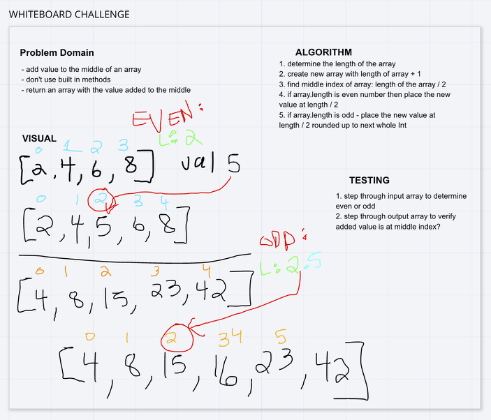

# Challenge Summary
This function takes in an array, and a value to be added to the array.
It returns a new array with the value added at the middle index.

[Code](ArrayShift.java) | [Test](../../../../test/java/codechallengestest/ArrayShiftTest.java)

## Challenge Description
Given an array of Ints, we have to figure out how to find the middle of the array,
create a new array with enough space to accommodate the existing values as well as the new one
, and insert the new value into the middle of the new array.

## Approach & Efficiency
Because the challenge explicitly instructed us not to use array methods, we used a for loop and
conditional statements to determine the midpoint & create a new array. 

- Efficiency: O(n)
- Space: O(1)

## Solution

#### Checklist

 - [x] Top-level README “Table of Contents” is updated
 - [x] Feature tasks for this challenge are completed
 - [x] Unit tests written and passing
     - [x] “Happy Path” - Expected outcome
     - [x] Expected failure
     - [x] Edge Case (if applicable/obvious)
 - [x] README for this challenge is complete
     - [x] Summary, Description, Approach & Efficiency, Solution
     - [x] Link to code
     - [x] Picture of whiteboard
