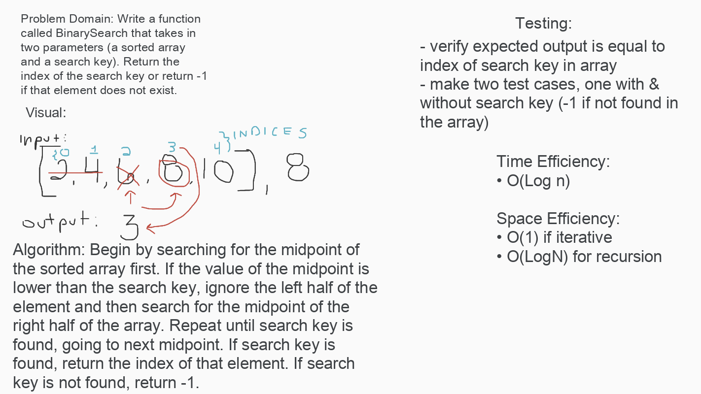

# Challenge Summary
This code challenge uses a binary search algorithm to find the index of
a specified value

[Code](BinarySearch.java) | [Tests](../../../../test/java/codechallengestest/BinarySearchTest.java)

## Challenge Description
Without using pre-defined java array methods, we wrote an algorithm to
perform a binary search on a sorted array. The function returns the index
of the search value if found, and -1 if not found.

## Approach & Efficiency
We used an iterative implementation achieving the following
efficiency:

- Time: O(Log n)
- Space: O(1)

## Solution
