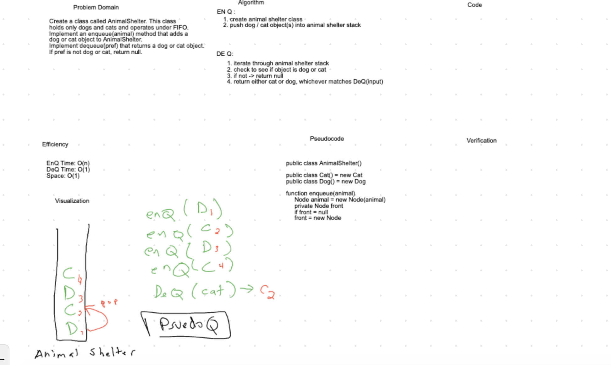

# Challenge Summary
Create A FIFO Animal Shelter with the ability to add Cat & Dog Objects, and retrieve them.

[Code](AnimalShelter.java) |
[Tests](../../../../../../challenge401/src/test/java/codechallengestest/FifoShelterTest.java)

## Challenge Description
EnQ adds an animal object to the shelter.
DeQ returns a specified animal object from the shelter.

## Approach & Efficiency

- EnQ Efficiency: O(1)
- DeQ Efficiency: O(n)
- Space: O(n)

## Solution

### Checklist
 - [x] Top-level README “Table of Contents” is updated
 - [x] Feature tasks for this challenge are completed
 - [x] Unit tests written and passing
     - [x] “Happy Path” - Expected outcome
     - [x] Expected failure
     - [x] Edge Case (if applicable/obvious)
 - [x] README for this challenge is complete
     - [x] Summary, Description, Approach & Efficiency, Solution
     - [x] Link to code
     - [x] Picture of whiteboard    