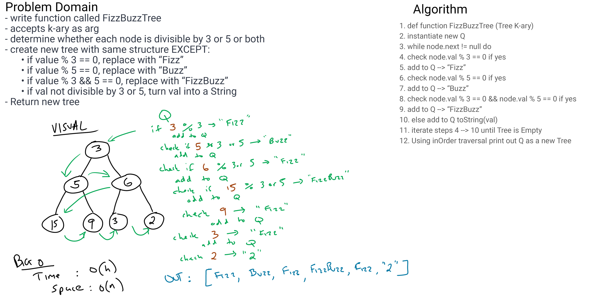

# Challenge Summary
Fizzbuzz Tree

[Code](FizzBuzzTree.java) |
[Tests]()

## Challenge Description
Traverse a `k-ary tree`, 
- if divisible by 3 return "Fizz"
- divisible by 5 return "Buzz"
- divisible by both return "FizzBuzz"
- divisible by neither, Stringify

return a new Tree

## Approach & Efficiency
Breadth first traversal, checking each node, adding it to a new Queue.
Iterate through Q, return as a Tree.

## Solution
    