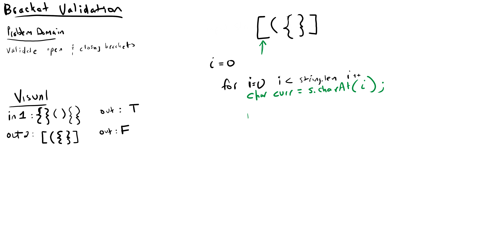

# Challenge Summary
This method checks the input of a string & determines whether brackets are 
opened and closed properly

[Code](MultiBracketValidation.java) |
[Tests](../../../../../../challenge401/src/test/java/codechallengestest/BracketTest.java)

## Challenge Description
This function uses a hashmap & a stack to identify brackets within a string & verify
that they are syntactically correct.

## Approach & Efficiency
- Time: O(n)
- Space: O(n)

## Solution

### Checklist
 - [x] Top-level README “Table of Contents” is updated
 - [x] Feature tasks for this challenge are completed
 - [x] Unit tests written and passing
     - [x] “Happy Path” - Expected outcome
     - [x] Expected failure
     - [x] Edge Case (if applicable/obvious)
 - [x] README for this challenge is complete
     - [x] Summary, Description, Approach & Efficiency, Solution
     - [x] Link to code
     - [x] Picture of whiteboard
    