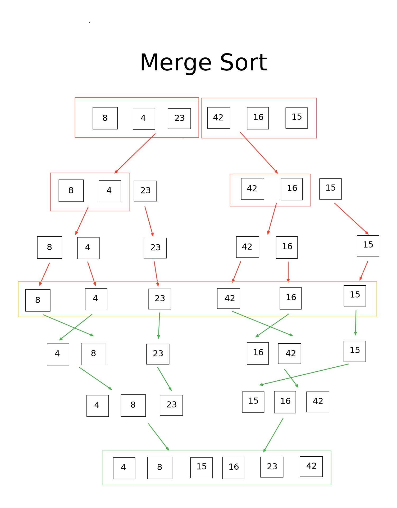

# Challenge Summary
This challenge utilizes a Merge Sort algorithm to sort an array of integers.

## Challenge Description
Merge sort is a divide-and-conquer algorithm based on the idea of breaking down a list into several sub-lists until each sublist consists of a single element and merging those sublists in a manner that results into a sorted list.

## Approach & Efficiency
This algorithm utilizes a recursive merge/sort method

Time : **O(n log n)**  
Space : **O(n)**  

## Solution
   