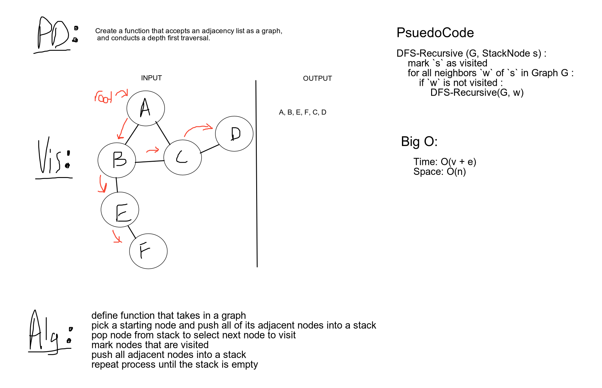

# Challenge Summary
Depth First traversal of a graph

## Challenge Description
This challenge will perform a depth first traversal of a graph using recursion. We start with a node, check for edges 
& neighbors. Using a boolean array, we mark each node visited. Upon visiting a node its value will be returned.

## Approach & Efficiency
Time: **O(n)**  
Space: **O(n)**  

## Solution
