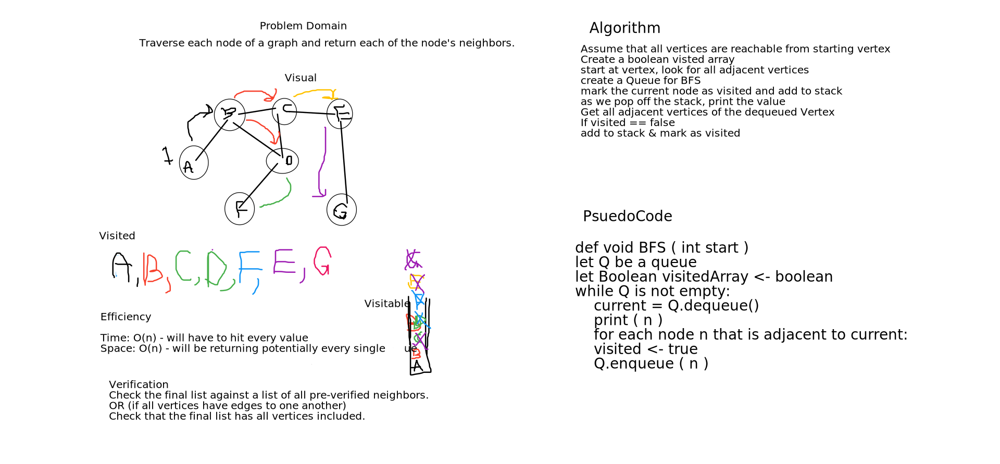

# Challenge Summary
Breadth First traversal of a graph

## Challenge Description
Method does a breadth-first traversal of a graph. It returns a linked list of values. We use a 
Queue to check whether a node has been visited or not. The node is added to the linked list
when it is popped off the Queue and marked visited. 

## Approach & Efficiency
Time: **O(v)**  
Space: **O(v)**  

## Solution
