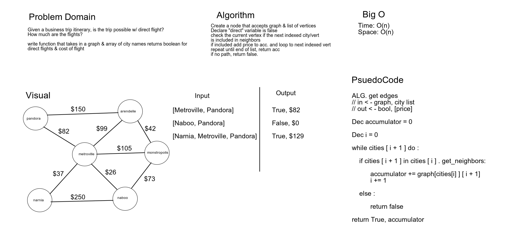

# Challenge Summary
Given a graph & string of cities, is a direct flight possible between two cities? If so how much will it cost?

## Challenge Description
Write a function which takes in a graph & an array of city names. This will traverse the graph, get the edges & compare them. 
If the two strings are direct neighbors return true & also return the edge weight.

## Approach & Efficiency
Time: **O(n)**  
Space: **O(n)**  

## Solution
