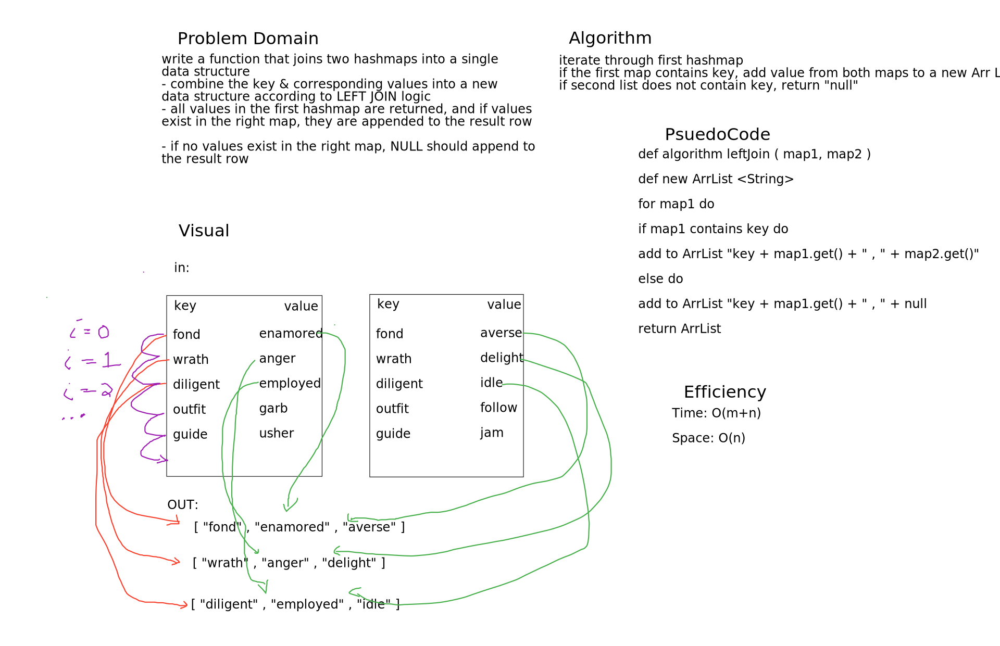

# Challenge Summary
Take two hashmaps & implement a left join

## Challenge Description
Define a function that takes two hashmaps as parameters. Iterate through the maps & determine whether the keys
match. If each map has a key, add the keys with its value to the list. Otherwise, add null to the list.

## Approach & Efficiency
Time: **O(m+n)**  
Space: **O(n)**  

## Solution
