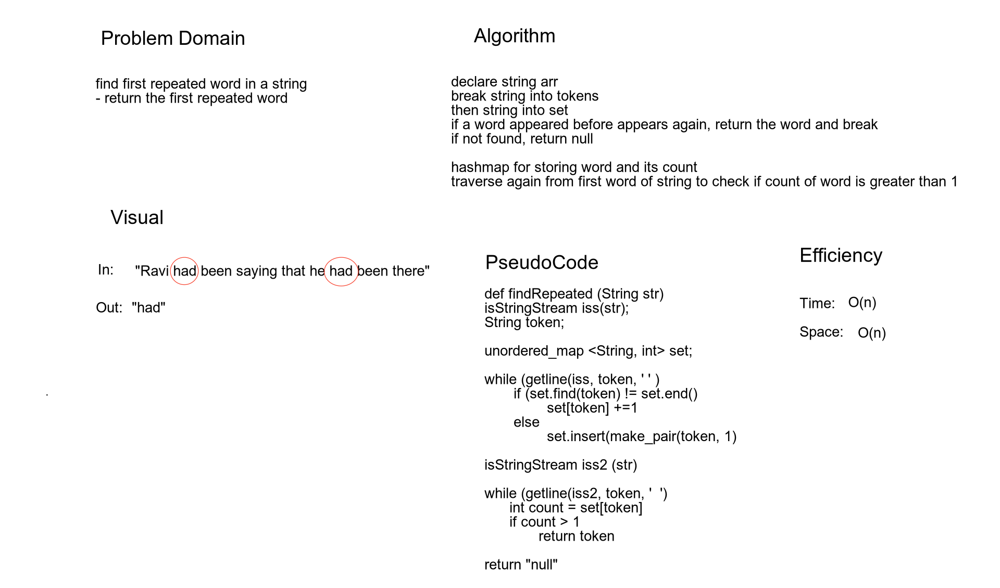

# Challenge Summary
This challenge finds & returns the first duplicate word in a string. 

## Challenge Description
This challenge uses a hash set to determine when a duplicate word is found. 
As it iterates through the string, if a duplicate word is found, it returns
that word as a string. 

## Approach & Efficiency
Time: **O(n)**  
Space: **O(n)**  

## Solution
