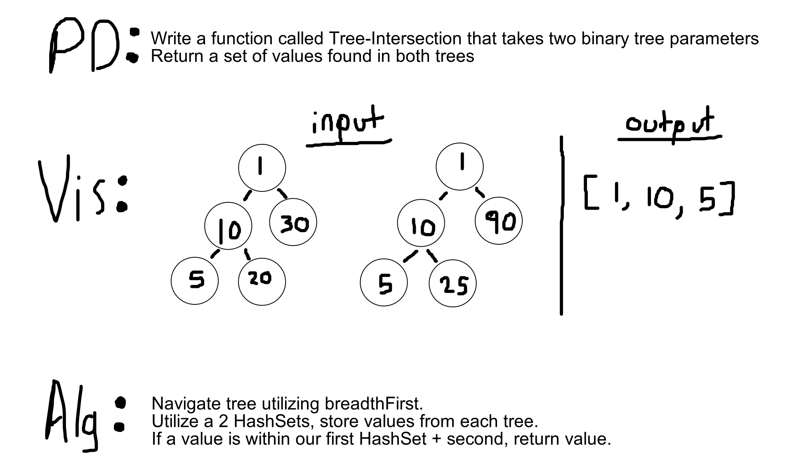

# Challenge Summary
This challenge finds duplicate node values in two Binary Trees & returns them as a Set. 

## Challenge Description
We take in two trees, add them to their own sets, then using a hash map we determine
which values are duplicate. The duplicate value is added to the array list
of integers and returned.

## Approach & Efficiency
Time: **O(n)**  
Space: **O(n)**  

## Solution
