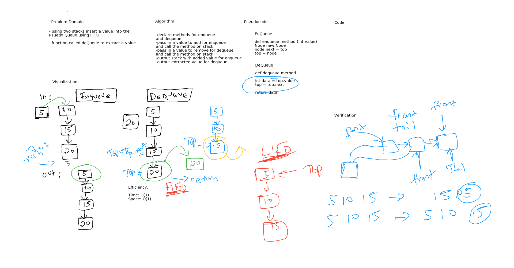

# Challenge Summary
This challenge creates a "Queue" using Stack methods

## Challenge Description
We implement a queue using Stack push, pop, isEmpty etc.

## Approach & Efficiency
Time: O(1)
Space: O(1)

## Solution
