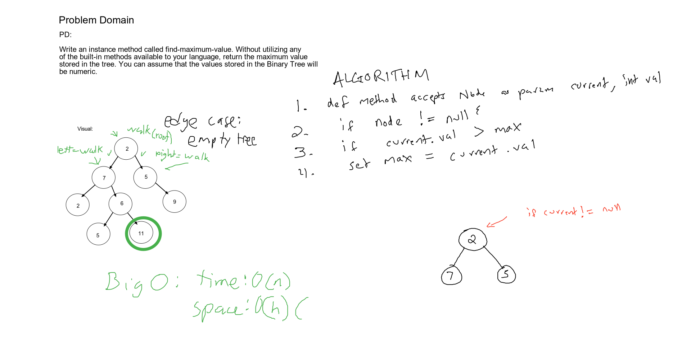

# Challenge Summary
Write a method that finds the maximum value in a Binary tree

[Code](../../../../../challenge401/src/main/java/datastructures/tree/BinaryTree.java) |
[Tests](../../../../../challenge401/src/test/java/datastructures/FindMaxValTest.java)

## Challenge Description
Without using any of the previously written or built in methods, write a function that
returns an `int` containing the maximum value found in the tree.

## Approach & Efficiency
**Recursive Approach**
1. define public function `findMaxVal` which takes no params & returns Int
2. declare int `max` as lowest possible value, `INTEGER.MIN_VALUE`
3. return val of function call `findMaxValUtil` passing in the `root`, and `max`
4. define private helper function `findMaxValUtil` which takes current Node & int max as params
5. check if current is null -> if yes return max
6. check if `current.value` > `max` -> if yes, set max to current value
7. if `current.value > max` evaluates to true, call `findMaxUtil` & pass `current.left`, `max`
8. if false -> call `findMaxUtil` passing `current.right`, `max`

- Time: O(h)
- Space: O(1)

## Solution

### Checklist
 - [x] Top-level README “Table of Contents” is updated
 - [x] Feature tasks for this challenge are completed
 - [x] Unit tests written and passing
     - [x] “Happy Path” - Expected outcome
     - [x] Expected failure
     - [x] Edge Case (if applicable/obvious)
 - [x] README for this challenge is complete
     - [x] Summary, Description, Approach & Efficiency, Solution
     - [x] Link to code
     - [x] Picture of whiteboard