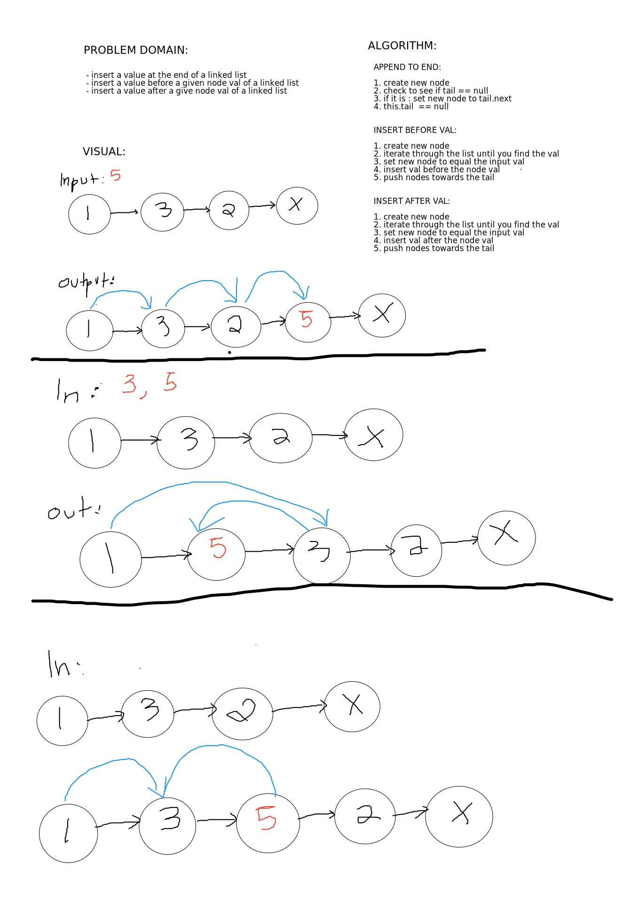

# Challenge Summary
Linked list insertions 

[Code](../../../../../challenge401/src/main/java/datastructures/linkedlist/LinkedList.java) | 
[Tests](../../../../../challenge401/src/test/java/datastructures/LinkedListTest.java)

## Challenge Description
this challenge will append values at the end of a linked list. it
will also append values into a specific location, either before
or after a given value.

## Approach & Efficiency
Time: O(1)  
Space: O(n)  

## Solution

#### Checklist
 - [x] Top-level README “Table of Contents” is updated
 - [x] Feature tasks for this challenge are completed
 - [x] Unit tests written and passing
     - [x] “Happy Path” - Expected outcome
     - [x] Expected failure
     - [x] Edge Case (if applicable/obvious)
 - [x] README for this challenge is complete
     - [x] Summary, Description, Approach & Efficiency, Solution
     - [x] Link to code
     - [x] Picture of whiteboard