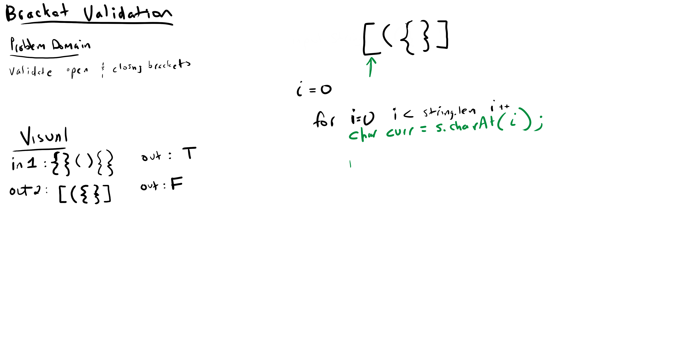

# Challenge Summary
This method checks the input of a string & determines whether brackets are 
opened and closed properly

## Challenge Description
This function uses a hashmap & a stack to identify brackets within a string & verify
that they are syntactically correct.

## Approach & Efficiency

- Time: O(n)
- Space: O(n)

## Solution
    