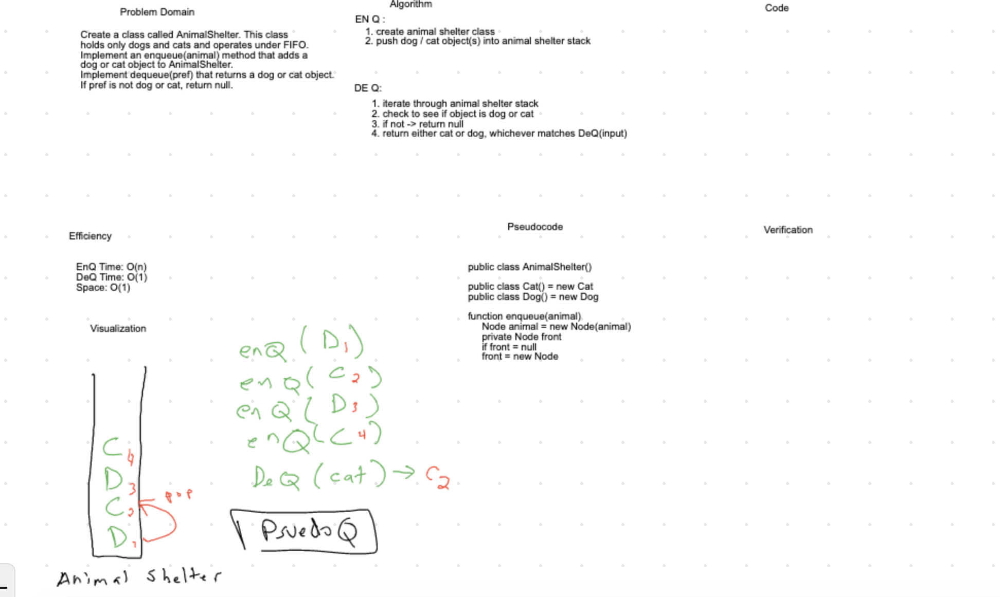

# Challenge Summary
Create A FIFO Animal Shelter with the ability to add Cat & Dog Objects, and retrieve them.

## Challenge Description
EnQ adds an animal object to the shelter.
DeQ returns a specified animal object from the shelter.

## Approach & Efficiency

- EnQ Efficiency: O(1)
- DeQ Efficiency: O(n)
- Space: O(n)

## Solution
    